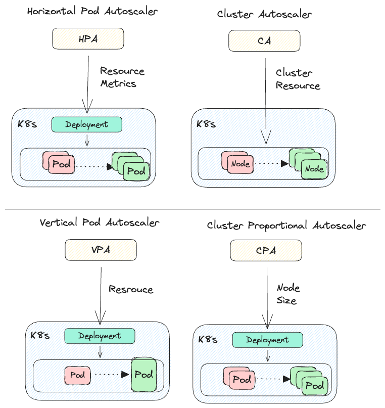
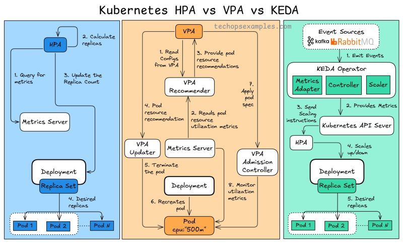

# k8s scalers








# ⚖️ Kubernetes Scalers Demo with AI Captioning App

This repository hosts a full-stack cloud-native application that acts as a **reference workload to test and demonstrate various Kubernetes autoscaling mechanisms**, including:

- Horizontal Pod Autoscaler (HPA)
- Vertical Pod Autoscaler (VPA)
- KEDA (Kubernetes Event-Driven Autoscaler)
- Karpenter (Just-in-Time Node Provisioning)
- Cluster Autoscaler (CAS)
- Cluster Proportional Autoscaler (CPA)

The workload is a **video captioning platform** with AI integration, multiple microservices, and cloud-native infrastructure components.

---


---

## 🚀 Application Features

- Upload videos using pre-signed S3 URLs
- Generate captions using ML (via Caption Worker + Deepgram)
- Store captions in MongoDB Atlas
- Route and authenticate through Gateway and Auth Services
- Publish events via RabbitMQ
- Integrate with AWS services: Lambda, SNS, S3, RDS, Redis, EC2

---

## ⚙️ Scalers Covered

| Scaler | Description | Use Case in This App |
|--------|-------------|----------------------|
| **HPA** | Scales pods based on CPU/memory/custom metrics | Scales Caption Worker/Upload Service under load |
| **VPA** | Automatically adjusts pod resource requests/limits | Applied to Caption Service and Auth Service |
| **KEDA** | Scales based on external event sources like RabbitMQ | Used to scale Caption Worker based on RabbitMQ queue length |
| **Karpenter** | Dynamically provisions nodes | Adds EC2 nodes when Caption Worker needs more capacity |
| **CAS** | Scales cluster nodes based on pending pods | Reacts to pod pressure in EKS |
| **CPA** | Scales core components based on cluster size (e.g., DNS) | Deployed as a control test |

---

## 📦 Microservices Overview

| Service         | Description |
|-----------------|-------------|
| **Gateway Service** | Entry point for internal traffic |
| **Upload Service**  | Handles video uploads |
| **Caption Worker**  | Asynchronous caption generation |
| **Caption Service** | Stores and serves captions |
| **Auth Service**    | Authn/Authz for users |

---


# 🚀 Kubernetes Scalers Demo with AI Captioning App

A scalable, microservices-based AI captioning platform deployed on Amazon EKS. Demonstrates dynamic autoscaling using Horizontal Pod Autoscaler (HPA), Vertical Pod Autoscaler (VPA), KEDA event-driven scaler, and Karpenter for efficient node provisioning. Built to showcase real-world autoscaling scenarios with API services and background workers.


### 🔗 High-Level Workflow

1. **Authentication**  
   The `auth-service` handles authentication, issuing and validating JWT tokens to secure access to all backend services.

2. **API Gateway**  
   The `gateway-service` acts as a unified entry point, routing incoming requests to the appropriate backend services while also applying shared middleware (e.g., token validation, logging).

3. **Video Upload**  
   The `upload-service` generates pre-signed URLs for **multipart uploads** to Amazon S3. The frontend directly uploads video files to S3 using these URLs.

4. **Caption Request**  
   After upload, the frontend calls the `caption-service`, providing the S3 video URL. The service:
   - Publishes a captioning task to **RabbitMQ**.
   - Starts streaming real-time status updates over a **Flask-based WebSocket** server (to which the frontend subscribes).
   - Uses **Redis Pub/Sub** to send progress updates to connected WebSocket clients.

5. **Caption Processing**  
   The `caption-worker` consumes tasks from RabbitMQ:
   - Downloads the video from S3.
   - Extracts audio using **FFmpeg**.
   - Sends the audio to **Deepgram** for transcription.
   - Stores the transcription results in **MongoDB**.
   - Publishes real-time updates to Redis for frontend feedback.

6. **Real-Time Feedback**  
   The frontend subscribes to the WebSocket stream exposed by `caption-service` to receive live updates on captioning progress.

7. **Fetching the Final Result**  
   Once the frontend receives a **"processed"** message through the WebSocket, it makes a `GET` request to `/result/<job-id>` (via `gateway-service`) to fetch the final transcription data from MongoDB.


## ⚖️ Kubernetes Autoscaling Components Explained

This project demonstrates multiple Kubernetes autoscaling mechanisms working in harmony to ensure cost-efficiency and high availability under variable load.

---

### 📈 Horizontal Pod Autoscaler (HPA)


**What it does:**  
Scales the number of pods in a deployment up/down based on CPU, memory, or custom metrics.

**Example:**  
If CPU usage goes above 80%, HPA will spin up more pods of that service.

**Used For:**  
- Scaling stateless microservices like `auth-service`, `upload-service`, etc.

---

### 📊 Vertical Pod Autoscaler (VPA)

**What it does:**  
Automatically adjusts resource **requests and limits** (CPU, memory) of containers based on actual usage patterns over time.

**Example:**  
If a service consistently uses more memory than requested, VPA will suggest or apply a higher memory request to avoid OOM kills.

**Used For:**  
- Memory-sensitive pods where tuning is difficult
- Workloads with variable resource footprints

---

### ⏱️ KEDA (Kubernetes Event-Driven Autoscaler)

**What it does:**  
Scales pods based on **external event sources**, such as:
- RabbitMQ queue length
- Kafka lag
- Redis key count
- HTTP requests, Prometheus metrics, etc.

**Example:**  
If 1000 messages are in the RabbitMQ queue, KEDA will scale `caption-worker` pods accordingly.

**Used For:**  
- Event-driven workloads  
- `caption-worker` (RabbitMQ scaler)

---

### 🔁 Cluster Proportional Autoscaler (CPA)


**What it does:**  
Scales specific components (like DNS, CoreDNS) **in proportion to cluster size** (number of nodes or cores).

**Used For:**  
- System components that must scale with the cluster (not app pods)

---


### 🧠 Cluster Autoscaler (CAS)


**What it does:**  
Monitors pods that can't be scheduled due to resource constraints and automatically adds or removes **EC2 nodes** to/from the cluster.

**Limitation:**  
- Can be slow to react
- Doesn’t support flexible provisioning strategies

---

### 🚀 Karpenter (Next-gen Node Autoscaler)

**What it does:**  
Intelligently provisions nodes based on **real-time pod requirements**. It can:
- Launch EC2 nodes with exact compute/memory/GPU needs
- Choose spot/on-demand based on cost and availability
- Automatically consolidate underutilized nodes

**Why Karpenter > CAS:**  
- Faster response time
- More cost-efficient
- Works well with dynamic, unpredictable workloads

**Used For:**  
- Entire cluster node management
- Dynamic, bursty workloads (e.g. caption jobs)

---

## ✅ Prerequisites

Make sure you have the following installed and configured before you begin:

### 🔧 Tools

- [Terraform](https://developer.hashicorp.com/terraform/downloads)
- [AWS CLI](https://docs.aws.amazon.com/cli/latest/userguide/install-cliv2.html)
- [kubectl](https://kubernetes.io/docs/tasks/tools/)
- [Helm](https://helm.sh/docs/intro/install/)
- [Docker](https://www.docker.com/)
- [Packer](https://developer.hashicorp.com/packer/install)
- Python 3.10+

### ☁️ AWS Requirements

- An AWS account
- AWS credentials configured (`~/.aws/credentials`)
- IAM user with sufficient permissions to:
  - Provision EKS clusters
  - Manage EC2, IAM, S3, VPC, and related services
  - Use CloudFormation, SNS, SQS, Lambda, and Auto Scaling
  - Create and manage DocumentDB, RDS, ElastiCache
  - Use ECR to push/pull container images

### ⚙️ Kubernetes Ecosystem

- [Karpenter](https://karpenter.sh/) (for node autoscaling)
- [KEDA](https://keda.sh/) (for event-based autoscaling)
- [HPA (Horizontal Pod Autoscaler)](https://kubernetes.io/docs/tasks/run-application/horizontal-pod-autoscale/)
- [VPA (Vertical Pod Autoscaler)](https://github.com/kubernetes/autoscaler/tree/master/vertical-pod-autoscaler)
- [CPA (Cluster Proportional Autoscaler)](https://github.com/kubernetes-sigs/cluster-proportional-autoscaler)
- [CA (Cluster Autoscaler)](https://github.com/kubernetes/autoscaler/tree/master/cluster-autoscaler)

> 📝 You can install these via Helm or YAML manifests provided in this repo under `/infra-definitions/autoscalers`


## 🐳 Build Docker Images Locally

Before provisioning infrastructure with Terraform, you need to build Docker images for each microservice.

### 📁 Microservices to Build

- `auth-service`
- `upload-service`
- `caption-service`
- `caption-worker`
- `gateway-service`
- `frontend`

### 🔨 Build Commands

Run the following commands in the root directory of each service:

```bash
# Navigate into the service directory
cd src/<service-name>

# Build Docker image
docker build -t <service_name>:latest .
```
Replace <your-dockerhub-username> and <service-name> accordingly.

💡 You can use a script to automate this for all services.


> ⚙️ Once you’ve built all the Docker images locally, Terraform will handle tagging and pushing them to ECR using a generated script (`scripts/image_push.sh`).

## Infrastructure Provisioning

### 1. Initialize the Terraform working directory
terraform init

### 2. Preview the infrastructure changes
terraform plan -var-file="terraform.tfvars"

### 3. Apply the infrastructure changes
terraform apply -var-file="terraform.tfvars"

### 4. (Optional) Destroy the infrastructure when done
terraform destroy -var-file="terraform.tfvars"
