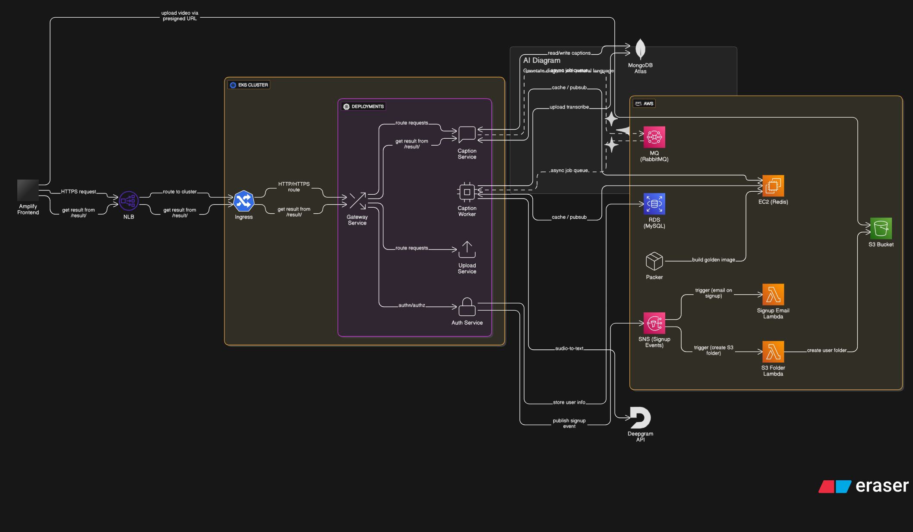

# 🚀 Kubernetes Scalers Demo with AI Captioning App

A scalable, microservices-based AI captioning platform deployed on Amazon EKS. Demonstrates dynamic autoscaling using Horizontal Pod Autoscaler (HPA), Vertical Pod Autoscaler (VPA), KEDA event-driven scaler, and Karpenter for efficient node provisioning. Built to showcase real-world autoscaling scenarios with API services and background workers.




### 🔗 High-Level Workflow

1. **Authentication**  
   The `auth-service` handles authentication, issuing and validating JWT tokens to secure access to all backend services.

2. **API Gateway**  
   The `gateway-service` acts as a unified entry point, routing incoming requests to the appropriate backend services while also applying shared middleware (e.g., token validation, logging).

3. **Video Upload**  
   The `upload-service` generates pre-signed URLs for **multipart uploads** to Amazon S3. The frontend directly uploads video files to S3 using these URLs.

4. **Caption Request**  
   After upload, the frontend calls the `caption-service`, providing the S3 video URL. The service:
   - Publishes a captioning task to **RabbitMQ**.
   - Starts streaming real-time status updates over a **Flask-based WebSocket** server (to which the frontend subscribes).
   - Uses **Redis Pub/Sub** to send progress updates to connected WebSocket clients.

5. **Caption Processing**  
   The `caption-worker` consumes tasks from RabbitMQ:
   - Downloads the video from S3.
   - Extracts audio using **FFmpeg**.
   - Sends the audio to **Deepgram** for transcription.
   - Stores the transcription results in **MongoDB**.
   - Publishes real-time updates to Redis for frontend feedback.

6. **Real-Time Feedback**  
   The frontend subscribes to the WebSocket stream exposed by `caption-service` to receive live updates on captioning progress.

7. **Fetching the Final Result**  
   Once the frontend receives a **"processed"** message through the WebSocket, it makes a `GET` request to `/result/<job-id>` (via `gateway-service`) to fetch the final transcription data from MongoDB.


## ⚖️ Kubernetes Autoscaling Components Explained

This project demonstrates multiple Kubernetes autoscaling mechanisms working in harmony to ensure cost-efficiency and high availability under variable load.

---

### 📈 Horizontal Pod Autoscaler (HPA)


**What it does:**  
Scales the number of pods in a deployment up/down based on CPU, memory, or custom metrics.

**Example:**  
If CPU usage goes above 80%, HPA will spin up more pods of that service.

**Used For:**  
- Scaling stateless microservices like `auth-service`, `upload-service`, etc.

---

### 📊 Vertical Pod Autoscaler (VPA)

**What it does:**  
Automatically adjusts resource **requests and limits** (CPU, memory) of containers based on actual usage patterns over time.

**Example:**  
If a service consistently uses more memory than requested, VPA will suggest or apply a higher memory request to avoid OOM kills.

**Used For:**  
- Memory-sensitive pods where tuning is difficult
- Workloads with variable resource footprints

---

### ⏱️ KEDA (Kubernetes Event-Driven Autoscaler)

**What it does:**  
Scales pods based on **external event sources**, such as:
- RabbitMQ queue length
- Kafka lag
- Redis key count
- HTTP requests, Prometheus metrics, etc.

**Example:**  
If 1000 messages are in the RabbitMQ queue, KEDA will scale `caption-worker` pods accordingly.

**Used For:**  
- Event-driven workloads  
- `caption-worker` (RabbitMQ scaler)

---

### 🔁 Cluster Proportional Autoscaler (CPA)


**What it does:**  
Scales specific components (like DNS, CoreDNS) **in proportion to cluster size** (number of nodes or cores).

**Used For:**  
- System components that must scale with the cluster (not app pods)

---


### 🧠 Cluster Autoscaler (CAS)


**What it does:**  
Monitors pods that can't be scheduled due to resource constraints and automatically adds or removes **EC2 nodes** to/from the cluster.

**Limitation:**  
- Can be slow to react
- Doesn’t support flexible provisioning strategies

---

### 🚀 Karpenter (Next-gen Node Autoscaler)

**What it does:**  
Intelligently provisions nodes based on **real-time pod requirements**. It can:
- Launch EC2 nodes with exact compute/memory/GPU needs
- Choose spot/on-demand based on cost and availability
- Automatically consolidate underutilized nodes

**Why Karpenter > CAS:**  
- Faster response time
- More cost-efficient
- Works well with dynamic, unpredictable workloads

**Used For:**  
- Entire cluster node management
- Dynamic, bursty workloads (e.g. caption jobs)

---

## ✅ Prerequisites

Make sure you have the following installed and configured before you begin:

### 🔧 Tools

- [Terraform](https://developer.hashicorp.com/terraform/downloads)
- [AWS CLI](https://docs.aws.amazon.com/cli/latest/userguide/install-cliv2.html)
- [kubectl](https://kubernetes.io/docs/tasks/tools/)
- [Helm](https://helm.sh/docs/intro/install/)
- [Docker](https://www.docker.com/)
- [Packer](https://developer.hashicorp.com/packer/install)
- Python 3.10+

### ☁️ AWS Requirements

- An AWS account
- AWS credentials configured (`~/.aws/credentials`)
- IAM user with sufficient permissions to:
  - Provision EKS clusters
  - Manage EC2, IAM, S3, VPC, and related services
  - Use CloudFormation, SNS, SQS, Lambda, and Auto Scaling
  - Create and manage DocumentDB, RDS, ElastiCache
  - Use ECR to push/pull container images

### ⚙️ Kubernetes Ecosystem

- [Karpenter](https://karpenter.sh/) (for node autoscaling)
- [KEDA](https://keda.sh/) (for event-based autoscaling)
- [HPA (Horizontal Pod Autoscaler)](https://kubernetes.io/docs/tasks/run-application/horizontal-pod-autoscale/)
- [VPA (Vertical Pod Autoscaler)](https://github.com/kubernetes/autoscaler/tree/master/vertical-pod-autoscaler)
- [CPA (Cluster Proportional Autoscaler)](https://github.com/kubernetes-sigs/cluster-proportional-autoscaler)
- [CA (Cluster Autoscaler)](https://github.com/kubernetes/autoscaler/tree/master/cluster-autoscaler)

> 📝 You can install these via Helm or YAML manifests provided in this repo under `/infra-definitions/autoscalers`


## 🐳 Build Docker Images Locally

Before provisioning infrastructure with Terraform, you need to build Docker images for each microservice.

### 📁 Microservices to Build

- `auth-service`
- `upload-service`
- `caption-service`
- `caption-worker`
- `gateway-service`
- `frontend`

### 🔨 Build Commands

Run the following commands in the root directory of each service:

```bash
# Navigate into the service directory
cd src/<service-name>

# Build Docker image
docker build -t <service_name>:latest .
```
Replace <your-dockerhub-username> and <service-name> accordingly.

💡 You can use a script to automate this for all services.


> ⚙️ Once you’ve built all the Docker images locally, Terraform will handle tagging and pushing them to ECR using a generated script (`scripts/image_push.sh`).


--- 

## 🖼️ Image Building (Redis AMI with Packer)

Before building the AMI, make sure you update the AMI ID placeholder in the `auto.pkrvars.hcl` file:

### 🔧 Set Base AMI
Open the file:
    infra/packer/auto.pkrvars.hcl


1.Find and replace the placeholder value for `source_ami` like this:

```hcl
source_ami = "ami-xxxxxxxxxxxxxxxxx"  # ✅ Replace with latest Amazon Linux 
```
2 AMI or base image of your choice
```bash
aws ec2 describe-images \
  --owners amazon \
  --filters "Name=name,Values=amzn2-ami-hvm-*-x86_64-gp2" \
  --query 'Images[*].[ImageId,Name]' \
  --output text | sort -k2
```

## 🧱 Building AMIs with Packer

Before deploying infrastructure, build the required AMI (e.g., Redis image) using [Packer](https://developer.hashicorp.com/packer).

### 🔧 Steps to Build the AMI

```bash
cd infra/packer/

packer init .

packer fmt .

packer build -var-file="auto.pkrvars.hcl" redis.pkr.hcl
```


## 🧱 Infrastructure Provisioning

Terraform provisions all necessary AWS infrastructure components including:

- VPC, Subnets, Internet Gateway, Route Tables
- EKS Cluster & Node Groups (or Karpenter setup)
- IAM Roles and Policies
- MongoDB (via DocumentDB or EC2)
- S3 Buckets, ECR Repos, and other dependencies

### 🛠️ Step-by-Step

```bash
cd infra/

# Initialize Terraform working directory
terraform init

# Review planned actions
terraform plan -var-file="terraform.tfvars"

# Apply infrastructure
terraform apply -var-file="terraform.tfvars"

# optional destroy
terraform destroy -var-file="terraform.tfvars"
```

### 🔗 Connect to the EKS Cluster

Once the infrastructure is successfully provisioned via Terraform, update your local `kubeconfig` to interact with the EKS cluster using `kubectl`:

```bash
aws eks update-kubeconfig --region <your-aws-region> --name <your-cluster-name>
```

# 📈 Horizontal Pod Autoscaler (HPA)

Horizontal Pod Autoscaler (HPA) automatically scales the number of pods in a Kubernetes Deployment or ReplicaSet based on observed CPU/memory usage or custom/external metrics.

### ✅ HPA is enabled for the following services:

| Service           | Supported Metric Types                                                               |
|-------------------|----------------------------------------------------------------------------------------|
| `auth-service`    | ✅ CPU, Memory (Resource) <br> ✅ Requests/sec (Pod) <br> ✅ Object <br> ✅ External    |
| `caption-service` | ✅ CPU, Memory (Resource) <br> ✅ Requests/sec (Pod) <br> ✅ Object <br> ✅ External    |
| `upload-service`  | ✅ CPU, Memory (Resource) <br> ✅ Requests/sec (Pod) <br> ✅ Object <br> ✅ External    |

Each service supports HPA through organized  in the `HPA/` directory:

### 📁 Structure

HPA configurations are structured under:

```
HPA/
├── <service-name>/
│   ├── resource-metric/
│   │   ├── cpu/
│   │   ├── memory/
│   │   └── cpu_and_memory/
│   ├── pod-metric/
│   │   └── request_per_second/
│   └── external/
```


### 📌 HPA Usage Examples

```bash
# CPU-based HPA
kubectl apply -k HPA/auth-service/resource-metric/cpu/

# Memory-based HPA
kubectl apply -k HPA/auth-service/resource-metric/memory/

# CPU + Memory HPA
kubectl apply -k HPA/auth-service/resource-metric/cpu_and_memory/

# Request/sec Pod Metric HPA
kubectl apply -k HPA/auth-service/pod-metric/request_per_second/
```

## 🔧 Custom Metrics with Prometheus Adapter

To enable **HPA with custom metrics** like `requests per second`, we use the **Prometheus Adapter** with `k8s-prometheus-adapter`.

### 📁 Structure

```
.
├── request_per_sec/
│   ├── hpa.yaml                    # HPA using custom metric (e.g., HTTP RPS)
│   └── kustomization.yaml
└── scripts/
    ├── prom-adapter-install.sh     # Installs Prometheus Adapter via Helm
    ├── prom-install.sh             # Installs Prometheus stack (Prometheus + CRDs)
    ├── prom-repo-add.sh            # Adds Helm repo
    ├── prometheus-values.yaml      # Prometheus Helm values
    └── prometheus-adapter-values.yaml # Prometheus Adapter config (custom metrics)
```

### 🛠️ Setup Instructions

```bash
# Add Prometheus community Helm repo
bash scripts/prom-repo-add.sh

# Install Prometheus stack
bash scripts/prom-install.sh

# Install Prometheus Adapter for custom metrics
bash scripts/prom-adapter-install.sh
```

You can customize `prometheus-adapter-values.yaml` to match your custom metric names and target namespaces.

### 📈 Example: Enable RPS-Based HPA

```bash
kubectl apply -k request_per_sec/
```

The metric can be exposed via a sidecar or your application using Prometheus format:

```
# Example application metric exposed
http_requests_total{job="auth-service"} 1234
```

Prometheus Adapter will map this into a Kubernetes external metric for HPA to consume.


## 📊 Vertical Pod Autoscaler (VPA)

VPA dynamically adjusts **resource requests** (not limits) based on historical usage patterns. It’s useful for right-sizing containers.

### ✅ Services Using VPA

| Service           | Modes Supported                                     |
|-------------------|-----------------------------------------------------|
| `auth-service`    | ✅ CPU <br> ✅ Memory <br> ✅ CPU+Memory <br> ✅ Initial <br> ✅ Off |
| `caption-service` | ✅ CPU <br> ✅ Memory <br> ✅ CPU+Memory <br> ✅ Initial <br> ✅ Off |
| `upload-service`  | ✅ CPU <br> ✅ Memory <br> ✅ CPU+Memory <br> ✅ Initial <br> ✅ Off |

### 📁 Structure

```
VPA/
├── <service-name>/
│   ├── cpu/
│   ├── memory/
│   ├── cpu_and_memory/
│   ├── initial_recommend/
│   └── just_recommend/
```

### 📌 VPA Usage Examples

```bash
# Enable CPU-only VPA
kubectl apply -k VPA/auth-service/cpu/

# Enable Memory-only VPA
kubectl apply -k VPA/auth-service/memory/

# Enable CPU + Memory VPA
kubectl apply -k VPA/auth-service/cpu_and_memory/

# Initial mode (apply at pod creation)
kubectl apply -k VPA/auth-service/initial_recommend/

# Off mode (recommend only)
kubectl apply -k VPA/auth-service/just_recommend/

# View recommendations
kubectl describe vpa <vpa-name>
```

# ⚡ KEDA (Kubernetes Event-Driven Autoscaler)

**KEDA** automatically scales pods based on external event sources like message queues, Prometheus queries, or custom metrics. It’s ideal for workloads that spike in response to asynchronous events.

## ✅ KEDA is enabled for:

| Service         | Scaled Object            | Trigger Source         |
|-----------------|--------------------------|------------------------|
| `caption-worker`| RabbitMQ queue length    | `jobs` queue in RabbitMQ |

KEDA monitors the `jobs` queue and dynamically adjusts the number of `caption-worker` pods based on queue depth.

---

## 📦 KEDA Directory Structure

```bash
.
├── caption-worker
│   ├── keda.yaml               # ScaledObject definition
│   ├── keda-authn.yaml         # TriggerAuthentication for RabbitMQ
│   ├── kustomization.yaml      # Kustomize support
│   └── secret.yaml             # RabbitMQ connection secret
└── scripts
    └── install-keda.sh         # Automates KEDA installation
```
## 🛠️ Install KEDA in your cluster

You can use the included helper script to install KEDA via Helm:

```bash 
scripts/install-keda.sh
```

This script installs the latest KEDA release into the keda namespace.

## 🚀 Deploy KEDA for caption-worker

Apply the configuration using Kustomize:

```bash
kubectl apply -k KEDA/caption-worker/
```
This deploys:

 - A ScaledObject to define how many workers to run based on RabbitMQ queue length.

 - A TriggerAuthentication to securely connect to RabbitMQ.

 - A Secret with connection string.


# ⚖️ Cluster Proportional Autoscaler (CPA)

**Cluster Proportional Autoscaler (CPA)** automatically adjusts the number of replicas of critical cluster components (like CoreDNS) based on the cluster size — either by number of nodes or CPU cores.

It’s particularly useful for workloads where performance needs to scale **proportionally with the cluster**, rather than application demand.

---

## ✅ CPA Setup Overview

| Component        | Description                             |
|------------------|-----------------------------------------|
| `CoreDNS`        | Scaled based on node count or CPU cores |
| `metrics-server` | Required for resource metrics           |

---

## 📦 CPA Directory Structure

```bash
.
├── configmap.yaml         # Tuning rules (e.g., replica count formula)
├── deployment.yaml        # CPA deployment manifest
├── kustomization.yaml     # Kustomize support
├── role.yaml              # RBAC: Role
├── role-binding.yaml      # RBAC: RoleBinding
├── sa.yaml                # ServiceAccount for CPA
└── scripts
    ├── install-metric-server.sh  # Installs metrics-server
    └── values.yaml               # Optional Helm values
```

## 🛠️ How to Install CPA
📌 Make sure metrics-server is running — required for CPA to monitor cluster size.

1.Install metrics-server:
```
bash scripts/install-metric-server.sh
```

2.Deploy CPA using Kustomize:

```bash
kubectl apply -k CPA/
```

## This applies:

- Deployment for the CPA controller

- ConfigMap defining replica scaling logic

- RBAC resources (Role, RoleBinding, ServiceAccount)

